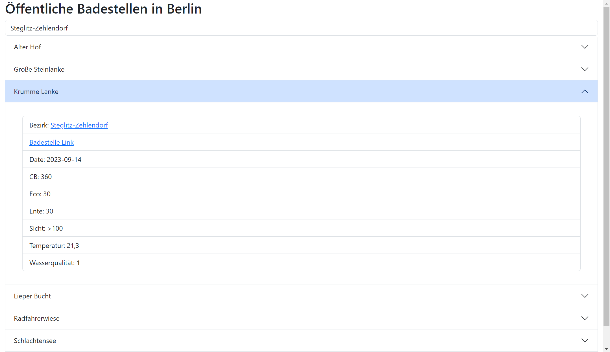

# Berlin Public Bathing Spots



This project is a React web application that displays information about public bathing spots in Berlin. It fetches data from the Berlin Health Department API and allows users to search for bathing spots by district. Each bathing spot provides details such as water quality, temperature, and more.

## Features

- Search for bathing spots by district.
- View detailed information about each bathing spot.
- Toggle accordion-style view for each bathing spot.
- Responsive design for mobile and desktop.

## Installation

1. Clone the repository:

   ```bash
   git clone https://github.com/your-username/berlin-bathing-spots.git

   ```

2. Navigate to the project directory:

   ```bash
   cd berlin-bathing-spots
   ```

3. Install dependencies:

   ```bash
   npm install
   ```

4. Start the development server:

   ```bash
   npm start
   ```

5. Open http://localhost:3000 in your browser.

Technologies Used:

React
TypeScript
CSS (with Sass)
Fetch API
